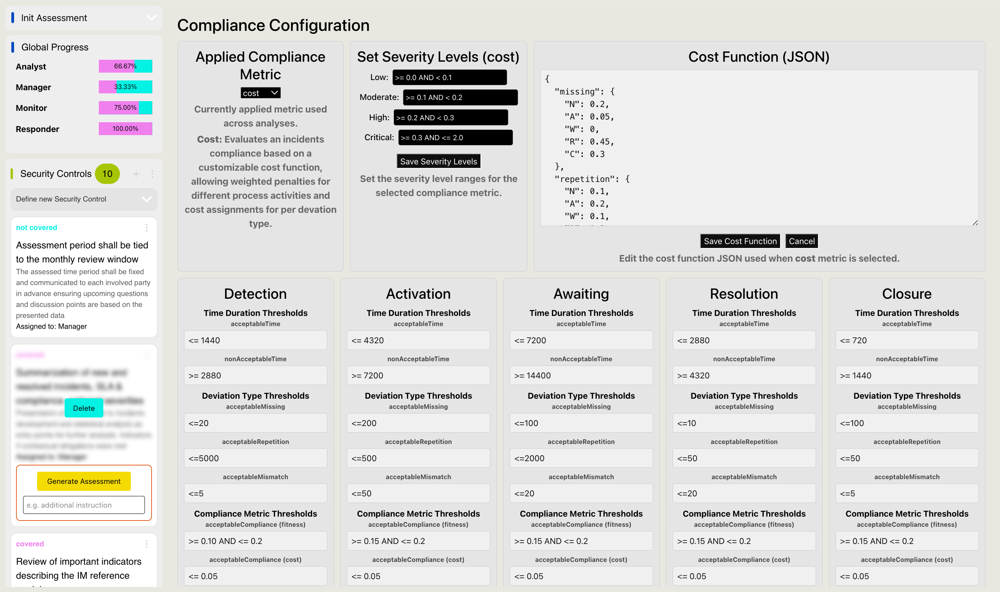
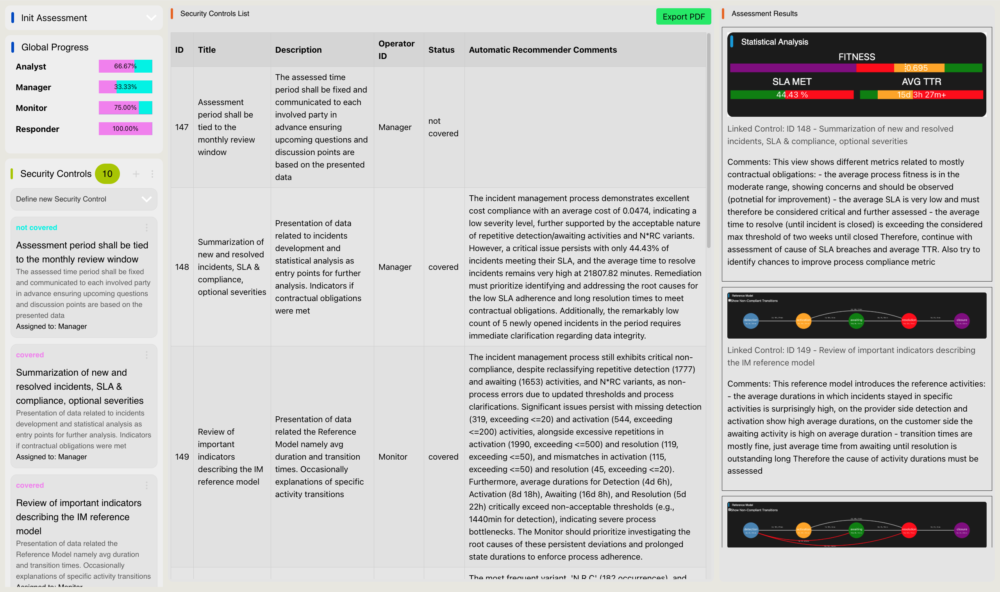

## AGORA
AGORA: Human-Supervised Automated Recommendations for Cybersecurity Compliance Auditing

Video Demo:
[Watch the video](https://www.youtube.com/watch?v=3DvxDxg8y68)

List of Requirements Elicitation:
[Requirements](AGORA_Requirements.pdf)

<table>
  <tr>
    <td>
      <h3>Compliance Configuration</h3>
      
    </td>
    <td>
      <h3>Reporting Manager</h3>
      
    </td>
  </tr>
</table>

# Extensive Use Case Descriptions:

List of all assessed security controls:
[Security Controls](AGORA_Security_Controls.csv)

- Use Case 1
  The first use case depicts the scenario in which the output on the level of compliance adherence given the inputs is assessed and reported. 
  This use case illustrates the effort of security operators to report the compliance status to upper
  management or interested parties, without any specific, critical, assessment trigger besides frequent compliance reporting obligations.
  
  After all mandatory inputs were successfully loaded into the system it automatically loads the subset of the recorded incidents
  according to the selected time period into the system components.
  
  Thus, the operator is able to generate an assessment for each security control via the automatic recommender component.
  The advantage in this approach is the capability of the automatic recommender to mimic the different operator roles according
  to the assigned operator in the security controls. 
  Therefore, the human operator does not necessarily have any role-related background among the modeled personas.
  The assessment result is then available in the reporting manager attached as a comment to the security control.
  Optionally, the human operator is able to give additional instructions to the recommender potentially related to previous assessment results.
  
- Use Case 2
  The second use case introduces multiple hypotheses about shortcomings in the previous assessment inputs and corrects them via
  a fine-tuned compliance configuration and updated instructions for the AI framework.
  Considering the analysis of the first use case, the compliance configuration is relaxed in terms of compliance boundaries.
  In fact, the selected time period in the compliance configuration remains the same, but activity compliance thresholds and such as activity-wise numbers per
  deviation type are fine-tuned together with a change in the applied compliance metric.

  Specifically, the operator performs the following reasoning and corrective actions:

  Instead of using the standard 'fitness' as compliance metric, the operator considers the context-aware trace alignment metrics to
  capture the context of the Incident Management process. In this way, the operator can implement appropriate corrective measures when
  context-unaware trace-fitness analysis is unable to clearly identify activity violations. To support this, weights and costs are assigned to activities and
  deviations such that activation and detection activities receive lower weights than errors occurring during the resolution phase.
  In addition, missing or mismatched activities are penalized more strongly than repetitive ones. This weighting scheme is justified by the
  possibility of multiple triggers for a single incident, as well as the fact that certain activities may occur without direct operator involvement.
  Repetitive detections do not reflect process errors but multiple triggers for the same technical activity such as mass Account creations
  from a single user, where each account creation triggers an incident. 
  Therefore, these repetitions can be considered handled in a different case, but the trigger occurred multiple times after each account creation.
  Thus, the corrective action is to increase the compliance threshold for repetitive detections and tolerate longer awaiting activities.
  
  The incident pattern reporting the sequence (Detection, Resolution, Closing) is caused by temporary merge rules, where for a specific incident as soon
  as there are new triggers, these are automatically merged to a leading case. 
  No operator was manually involved or assigned to the merged incidents. Therefore, there is no error in the actual process.
  The corrective action is to validate the missing activation activity between detection and resolution because of a non-process violating procedure
  via updated evaluation instructions to the automatic recommender.
  
  Repetitive awaiting activities relate to incidents assigned to a customer or third party side, where the actual security operators can
  not take influence in case handling. These repetitive process deviations occur after resubmission times were exceeded
  and the incident was not assigned back to the security operators. These can not be considered as process harming deviations since these are
  not in the control of the organization. The corrective action is to increase the threshold for repetitive awaiting activities
  in the compliance configuration because of a lack of influence to external stakeholders.
  
  After providing these changes in the compliance configuration, the automatic recommender is fine-tuned and re-run.
# Structure

This application uses React for frontend visualizations while python scripts are used for backend calculations.
Frontend and backend are connected via eel. Data are stored inside /my_app/src/data directory

# Dependencies

Prior to running the application, run in root directory:

### `pip install -r requirements.txt`

To install necessary python dependencies.

### `npm install`

To install necessary JavaScript dependencies.

### `echo 'GEMINI_API_KEY = "<YOUR_GEMINI_API_KEY>"' > src/backend/api_keys.py`

Replace <YOUR_GEMINI_API_KEY> with your API key for Google GEMINI

# Run the application

Start backend:
Inside /src/backend directory run:

### `python3 server.py true`

Afterwards in second terminal start the frontend from root directory by calling:

### `npm start`

This section has moved here: [https://facebook.github.io/create-react-app/docs/deployment](https://facebook.github.io/create-react-app/docs/deployment)

### `npm run build` fails to minify

This section has moved here: [https://facebook.github.io/create-react-app/docs/troubleshooting#npm-run-build-fails-to-minify](https://facebook.github.io/create-react-app/docs/troubleshooting#npm-run-build-fails-to-minify)
